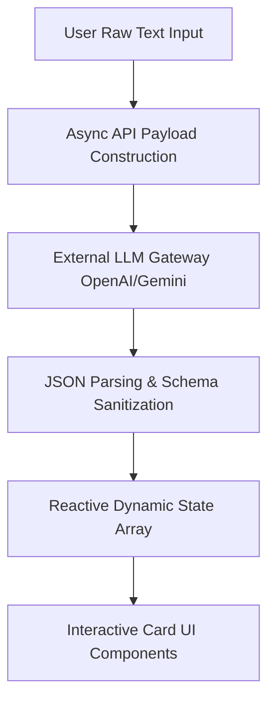

# 📊 Advanced Expense Tracker
[🔗 Click Here to Launch the Live Web App](https://netlify.app)

A high-throughput, web-based educational automation platform that parses unstructured raw text notes into structured, interactive study flashcards. This application integrates external large language models (LLMs) with robust client-side validation to provide instantaneous cognitive aids.

## 🏗️ Core Technical Architecture & Logic

- **Asynchronous External Gateway Integration:** Manages asynchronous network request life cycles to OpenAI/Gemini REST APIs using modern JavaScript promises (analogous to C++ multithreaded networking tasks). Features error-boundary structures to gracefully intercept API rate limits or connectivity drops.
- **Strict Data Deserialization & Validation:** Enforces strict formatting on incoming AI string payloads. Implements rigorous JSON parsing patterns to map raw tokens directly into validated structured objects, ensuring the runtime engine never encounters typing errors during code execution.
- **Dynamic Structural Array Rendering:** Translates the parsed data model array into responsive frontend interface components via map operators (conceptually identical to looping over an array of custom Structs in C++). Features clean, localized conditional triggers for tracking active card states (front/back flip states).

## 🛠️ Tech Stack & Systems Environment
- **Core Engine:** TypeScript / JavaScript (ES6+)
- **AI Engine:** Google Gemini / OpenAI API Gateway
- **Layout & Design Systems:** Tailwind CSS / Shadcn UI
- **Deployment Platform:** Vercel Cloud Architecture
